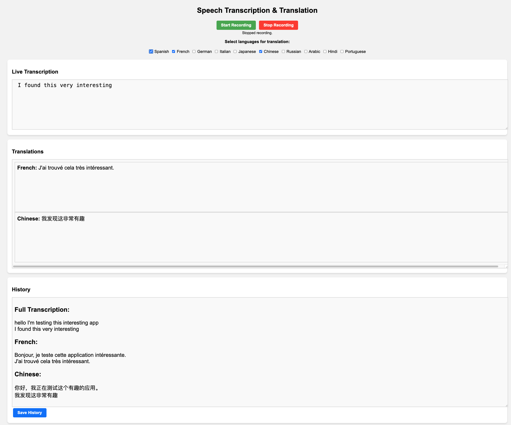

# 🎤 Speech Transcription & Translation App

🚀 **Real-time speech transcription and translation using OpenAI!**



This is a **real-time speech transcription and translation** app using:
- 🖥 **Frontend:** HTML, CSS, JavaScript
- 🌐 **Backend:** Node.js (Express)
- 🎙 **Speech-to-Text:** Web Speech API
- 🧠 **AI Translation:** OpenAI API
- ☁ **Hosting:** AWS (EC2/S3/Lambda)

## 🚀 Features
✅ **Live Transcription**: Displays only the last spoken sentence  
✅ **Multi-Language Translation**: Supports multiple languages  
✅ **Saves History**: Stores transcription & translations in separate files  
✅ **Resizable UI**: Users can resize text areas  
✅ **AWS Hosted**: Frontend on S3, Backend on EC2/Lambda  

---

## 🛠 Setup & Installation

### **1️⃣ Clone the Repository**
```sh
git clone https://github.com/oushinco/RT-Transcriblation
cd speech-transcription-app
